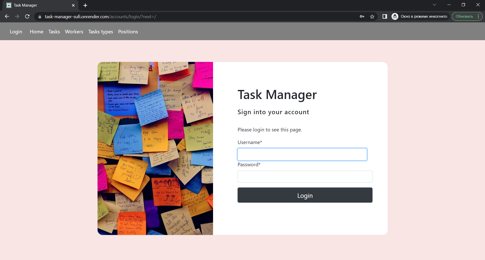
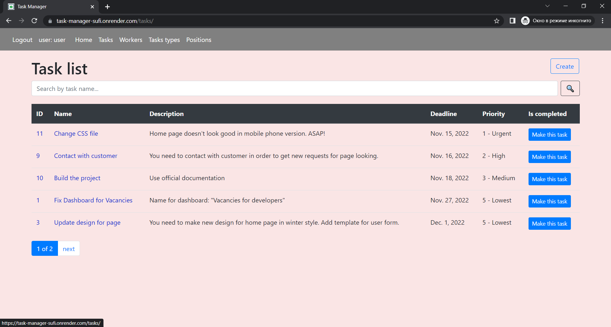

# Task Manager Project

Django Project for managing tasks in IT Company

## Check it out!

[Project deployed to Heroku](https://github.com/mate-academy/py-task-guideline/blob/main/README.md)

## Installation

Python3 must be already installed.

```shell
git clone https://github.com/olia-trofymchuk/task-manager
cd task-manager
python3 -m venv venv
source venv/bin/activate
pip install -r requirements.txt
python manage.py runserver # starts Django Server
```

## Features


* Authentication functionality for Worker/User
* Managing tasks: their types, deadlines, priority & information about workers + their positions
* Powerful admin panel for advanced managing
* Security for all data

Just sign in, create a task and you are off!

## DB Structure


## Demo pages

* Login page


* Home page


* Page with tasks

